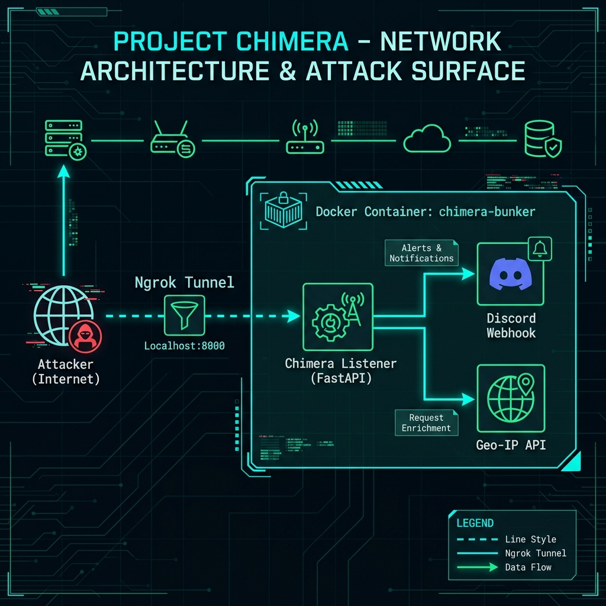
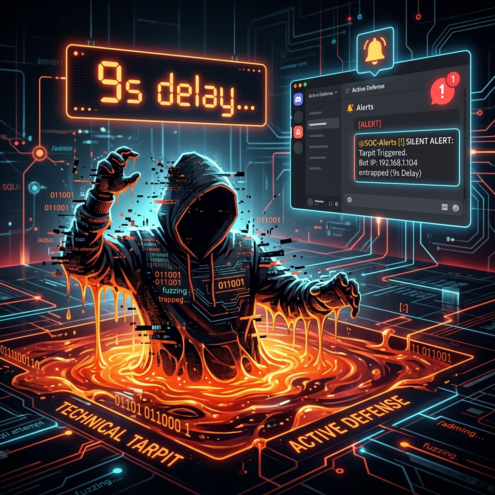

# 🎭 Project Chimera: Active Cyber Deception Engine


**Project Chimera** is a high-fidelity Active Cyber Deception (ACD) and HoneyToken engine designed to entrap, identify, and neutralize adversaries the moment they touch your infrastructure.



## 🏗️ Architecture: The Trinity of Deception

Chimera is built on three core pillars designed for stealth, speed, and actionable intelligence:

| Component | Code Name | Responsibility |
| :--- | :--- | :--- |
| **The Forge** | `Credential Engine` | Generates high-entropy, realistic fake credentials for AWS, Postgres, and .env files. |
| **The Trap** | `chimera_listener.py` | A hardened FastAPI server providing dynamic decoys and technical tarpits. |
| **The Webhook** | `Discord SOC` | Instantaneous, rich-embed alerts with Geo-IP enrichment. |

---

## 🛡️ Hardened Security (The Bunker)

Project Chimera is designed to be as secure as the systems it protects. The deployment is containerized within a "Hardened Bunker" architecture.


*   **Non-Root Execution**: Runs as `chimera_user` to prevent container breakout.
*   **Resource Pinning**: Strictly limited to 512MB RAM to mitigate DoS attempts against the host.
*   **Read-Only Filesystem**: The core engine operates in a locked environment.

---

## ⚡ Active Defense: Technical Tarpit

When an attacker probes for sensitive configuration files (like `.env`), Chimera doesn't just alert; it enters **Active Defense** mode.



The engine implements a **Technical Tarpit** that injects a configurable delay (default 9s) into the response. This slows down automated scanners, increases attacker "Time on Trap," and allows your SOC team to respond before the adversary moves to the next target.

---

## 🚀 Quick Start (Docker Deployment)

The most professional way to deploy Chimera is via Docker Compose.

### 1. Configure the SOC
Create a `.env` file with your credentials:
```env
DISCORD_WEBHOOK_URL=https://discord.com/api/webhooks/your-id/your-token
ALLOWED_HOSTS=*
PORT=8000
```

### 2. Launch the Bunker
```bash
docker compose up --build -d
```

### 3. Monitor Intelligence
```bash
docker logs -f chimera-bunker
```

---

## ✨ Features

- **🕵️ Advanced Bot Fingerprinting**: Detects scanners (Nmap, SQLMap, Nikto) via UA-Analysis.
- **🌍 Geo-IP Enrichment**: Automatically resolves attacker IP locations for faster triage.
- **📢 SOC Integration**: Real-time Discord notifications with Severity levels.
- **📑 Dynamic Honey Responses**: Serves realistic decoys tailored to the attack vector.

---

## ⚖️ Disclaimer

Project Chimera is intended for **defensive security purposes only**. Deployment of honeytokens must comply with local laws and organizational policies.

**Maintain the Illusion. Secure the Perimeter.**
